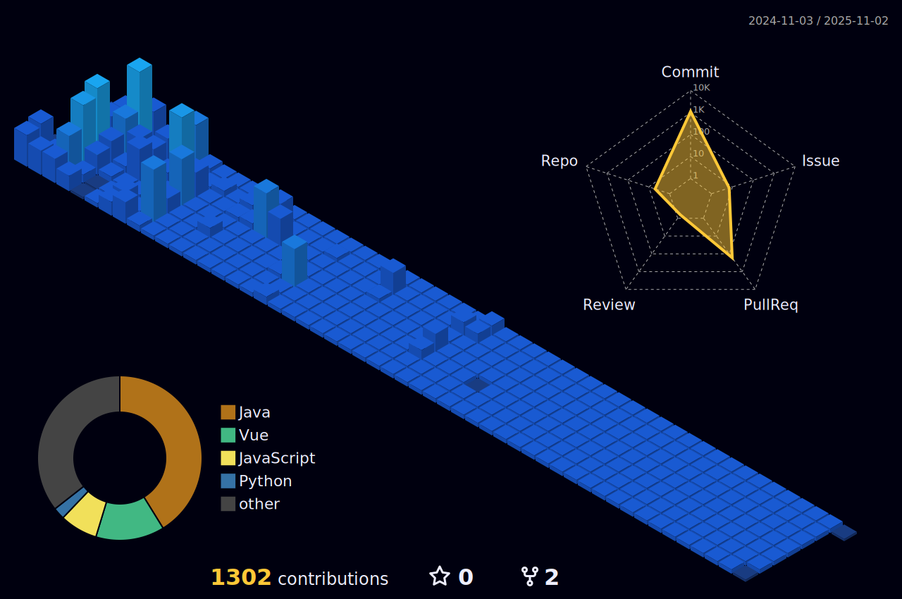

### 👋 Hi there!
> 최소비용 최대가치를 꿈꾸는 개발자 **박해인**입니다
> 

<!--

-->
<!--
<table>
  <tbody>
    <tr>
    <td align="center">
      
    </td>
    <td align="center">
      
    </td>
    </tr>
  </tbody>
</table>
-->
<!--
-->

<!---->

### 🔧 Skills 
    
   
      
        
<!--

  
  

-->

### 💪 CAREERS 
- **Amazon Web Services DCO Trainee `2025` -`PRESENT`** 

### 📝 EDUCATION

- **Bachelor of software at Duksung Women's University `2020`-`2023`**
- **SSAFY 12 `2024.07` ~ `2024.12`**

### 🏆 AWARDS

- **2021 제 9회 K-hackathon 우수상**
- **2023 제 2회 덕성 해커톤 최우수상**
- **2023 덕성여자대학교 캡스톤 디자인 경연대회 장려상**
- **2023 제 2회 DS-Datathon 최우수상**
- **2024 카카오 관광데이터 공모전 우수상**
- **2024 ICT콤플렉스 제 13회 SW개발 공모전 장려상**

### 🐾 EXPERIENCE

- **2021-2022 제 1대,2대 덕성여자대학교 소프트웨어전공 부학생회장**
- **2022 제 1회 덕성여자대학교 과학기술학부 해커톤 준비위원회 부운영위원장**
- **2023 제 1회 덕성여자대학교 소프트웨어전공 졸업준비위원회 위원장**

<!--
**femmefatalehaein/femmefatalehaein** is a ✨ _special_ ✨ repository because its `README.md` (this file) appears on your GitHub profile.

Here are some ideas to get you started:

- 🔭 I’m currently working on ...
- 🌱 I’m currently learning ...
- 👯 I’m looking to collaborate on ...
- 🤔 I’m looking for help with ...
- 💬 Ask me about ...
- 📫 How to reach me: ...
- 😄 Pronouns: ...
- ⚡ Fun fact: ...
-->
